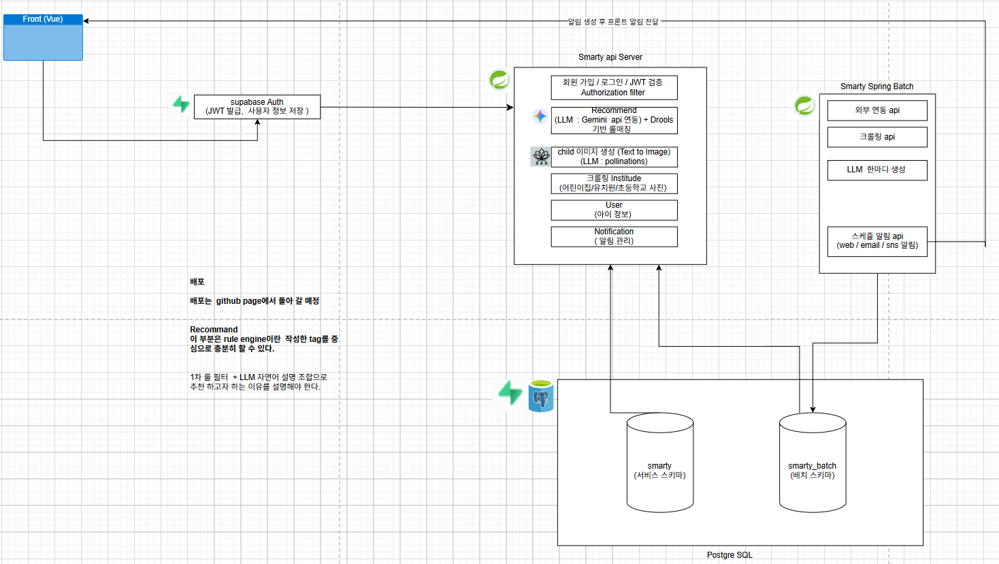

# ** Smarty Backend API **
```
    [개발 언어] :  kotlin 
    [DB] :  postgres
```

# ** Smarty mind Map Info. **


# ** Smarty table structure ** 
### [추후 수정 진행 예정]


# ** Smarty system structure ** 



# ** LLM 설정 **
```
   [gemini key] :  .env 파일에 셋팅해서 사용하기 
```